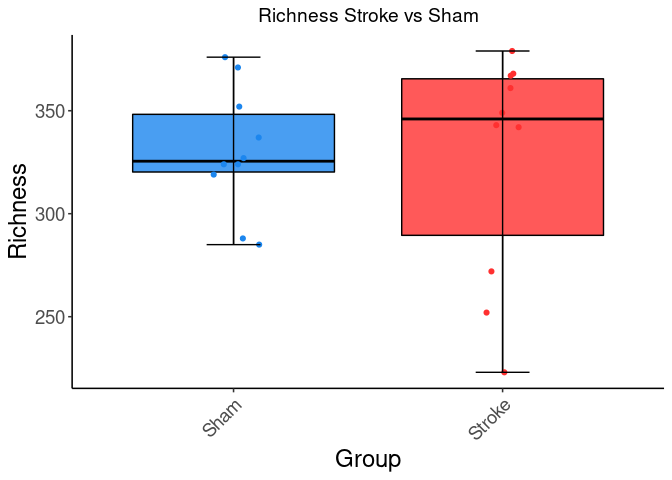
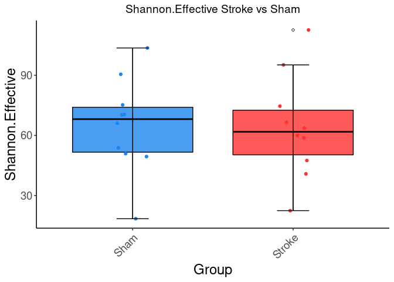
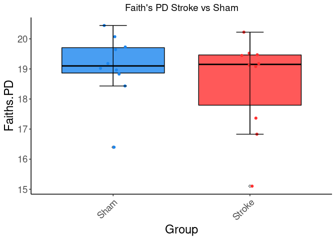
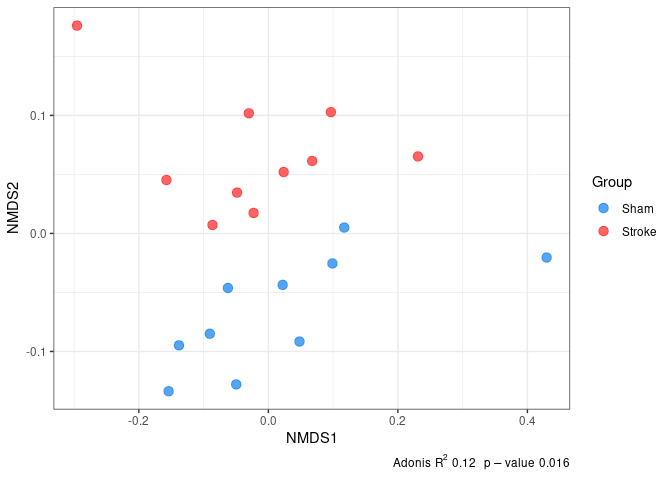

Microbiota\_Analysis
================
Adam Sorbie
26/10/2021

# Analysis of Microbiota data

This document contains code to analyse the microbiota data generated in
Sorbie, Jimenez and Benakis 2021 and is intended to act as template for
other stroke researchers to conduct their own analyses.

## Set-up 

To be able to perform these analyses you will first need to clone this repository (type ```git clone git@github.com:adamsorbie/Stroke_Microbiota_reproducibility.git``` and copy the ```analysis_functions.R``` script to your working directory/whichever directory  you prefer. You will also need a working installation of R and Rstudio to follow the tutorial below. 

Upon sourcing, this script should automatically install all the required packages, however if not you can install them manually like so: 

```
cran_pkgs <- c("tidyverse", "ggpubr", "rstatix", "picante", "phangorn", "GUniFrac", "zoo", "BiocManager")
bioC_pkgs <- c("phyloseq", "ANCOMBC") 

install.packages(cran_pkgs)

BiocManager::install(bioC_pkgs)
```

## Data Analysis 


``` r
source("../../scripts/analysis_functions.R")
```

    ## Loading required package: pacman

Firstly, we will read the ASV table(s) and metadata into R, using
phyloseq. We have included the data used in this publication to
demonstrate our analysis pipeline.

``` r
ps <- import_as_pseq(otu = "../../data/ASV_seqtab_tax.tab",
                mapping = "../../data/Metadata-16S-sequenced_wo_ctrls.txt",
                tree = "../../data/ASV_tree.tre")
```

    ## Warning: Expected 6 pieces. Additional pieces discarded in 461 rows [1, 2, 3, 4,
    ## 5, 6, 7, 8, 9, 10, 11, 12, 13, 14, 15, 16, 17, 18, 19, 20, ...].

Phyloseq is used as it provides a nice way of storing all the associated
data in one object or class. As you can see, the metadata, tree and ASV
table are all combined here into `ps`. Importantly, each part can also
be accessed invidivually.

## Data Normalisation

Here will transform the data using minimum sum normalisation and
relative abundance for downstream analyses.

### How does normalisation work?

Minimum sum normalisation works by dividing the sum in each sample by
the minimum sum across all samples, thereby standardising each sample to
a fixed sum.

Relative, transforms each sample into compositions, on a fixed scale of
0-100.

``` r
ps_norm <- transform(ps, transform = "mss")
ps_rel <- transform(ps, transform = "relative")
```

We can see how this works by looking at the column sums:

``` r
colSums(otu_table(ps_rel))
```

    ## RD118 RD122 RD124 RD126 RD127 RD128 RD130 RD131 RD132 RD162 RD165 RD166 RD167 
    ##   100   100   100   100   100   100   100   100   100   100   100   100   100 
    ## RD168 RD169 RD170 RD171 RD172 RD173 RD174 
    ##   100   100   100   100   100   100   100

``` r
colSums(otu_table(ps_norm))
```

    ##  RD118  RD122  RD124  RD126  RD127  RD128  RD130  RD131  RD132  RD162  RD165 
    ## 139635 139635 139635 139635 139635 139635 139635 139635 139635 139635 139635 
    ##  RD166  RD167  RD168  RD169  RD170  RD171  RD172  RD173  RD174 
    ## 139635 139635 139635 139635 139635 139635 139635 139635 139635

## Alpha Diversity

Here we will calculate three different measures of alpha-diversity:

-   Species richness, or the number of observed species
    -   This is calculated by
-   Shannon effective diversity, measuring
-   Faith’s PD, measuring the phylogenetic component of alpha diversity

The function `calc_alpha` wraps all of these calculations and only
requires the mss normalised phyloseq object as input, returning a
dataframe with a column for each above-mentioned dataframe.

``` r
alpha_div <- calc_alpha(ps_norm)
```

### How are alpha diversity metrics calculated?

Richness here is calculated as the the total number of observed species
greater than 0.5 mss normalised abundance. This threshold is used to
exclude noise (see Lagkouvardos et al 2017, PeerJ and Reitmeier et al
2021, ISME Communication for a more thorough explanation).

Shannon effective diversity is calculated as the exponent of the Shannon
index:

$$H = -\\sum\_{i=1}^{R} p\_i ln(p\_i)$$
where *R* = richness, *p<sub>i</sub>* is the relative abundance of
species *i* and *ln* is the natural logarithm.

This metric accounts for both the abundance and evenness of taxa.

Lastly, Faith’s alpha diversity is calulated as the sum of the branch
lengths in the phylogenetic tree. This method does not account for
abundance, only measuring the phylogenetic diversity of a sample.

Now we have calculated alpha diversity, we can merge this information
with our metadata to generate a dataframe for plotting.

``` r
meta <-meta_to_df(ps_norm)
# merge alpha diversity df and metadata by rownames (0)
alpha_div_meta <- merge(alpha_div, meta, by=0)
```

### Plotting

To plot the alpha diversity metrics we will use a boxplot with jittered
points layered on top. The function `plot_boxplot`will do this for you,
we just need to set some parameters first.

Firstly, we will list the statistical comparisons we want to make, by
creating a list of vectors. In this case we only have two groups, stroke
and sham which can be written like: `list(c("Stroke", "Sham"))`. If we
had an extra group, for example, “Control”, we would then have three
comparisons to define like so:
`list(c("Control", "Sham"), c("Control", "Stroke"), c("Sham", "Stroke"))`

Comparisons list

``` r
comps <- list(c("Stroke", "Sham"))
```

We can also specify the colours we want to use in our plots here by
creating a named vector of colours.

``` r
colours <- c("Sham" = "dodgerblue2", "Stroke" = "firebrick1")
```

To generate the plot we need to provide the dataframe, the name of the
column containing the grouping variable (in this case simply “Group”),
the name of the column containing the values to plot (Richness here). To
colour by group we provide the column name of the grouping variable to
`fill_var`. We can then add the list of comparisons, some x and y-axis,
a title if desired and the plot colours.

In instances where the alphabetical order of your group levels does not
match the order you would like to plot them in, you can specify this
here with the `group.order`parameter.

#### Richness

``` r
plot_boxplot(df = alpha_div_meta, variable_col = "Group", value_col = "Richness", 
             fill_var = "Group", comparisons_list = comps, xlab = "Group", 
             ylab = "Richness", p_title = "Richness Stroke vs Sham", 
             col_palette = colours, group.order = c("Sham", "Stroke")) 
```

    ## [1] "Sham"   "Stroke"

<!-- -->
\#\#\#\# Shannon Effective

``` r
plot_boxplot(df = alpha_div_meta, variable_col = "Group", value_col = "Shannon.Effective", 
             fill_var = "Group", comparisons_list = comps, xlab = "Group", 
             ylab = "Shannon.Effective", p_title = "Shannon.Effective Stroke vs Sham", 
             col_palette = colours, group.order = c("Sham", "Stroke")) 
```

    ## [1] "Sham"   "Stroke"

<!-- -->

#### Faith’s PD

``` r
plot_boxplot(df = alpha_div_meta, variable_col = "Group", value_col = "Faiths.PD", 
             fill_var = "Group", comparisons_list = comps, xlab = "Group", 
             ylab = "Faiths.PD", p_title = "Faith's PD Stroke vs Sham", 
             col_palette = colours, group.order = c("Sham", "Stroke")) 
```

    ## [1] "Sham"   "Stroke"

<!-- -->

Statistical significance is calculated internally in the `plot_boxplot`
function using unpaired wilcoxon, thus currently this function is only
suitable when groups are independent. Note that if no significance is
displayed on the plot, the the differences between groups were not
statistically significant.

## Beta Diversity

Here we will calculate beta-diversity based on Generalized unifrac
distance and plot an ordination of this using Non-metric
multidimensional scaling.

The `calc_betadiv` function calculates a distance matrix, and an
ordination of that matrix, returning both as a list.

Various dissimilarity indices are available:

-   Bray-Curtis - A count-based dissimilarity metric (beta-diversity),
    based on the fraction of overabundant counts.
-   Unifrac - A phylogenetic beta-diversity metric measuring the
    fraction of unique branches in a phylogenetic tree.  
-   Weighted Unifrac - An extensions of unifrac taking abundance into
    account in addition
-   Generalized Unifrac - A further extension of unifrac, placing less
    weight on highly-abundant lineages.

Similarly, there are also various ordination options:

-   NMDS (default) - Non-Metric Multidimensional Scaling. An ordination
    method which attempts to represent the dissimilarity between
    samples, as closely as possible in a low-dimensional space.
-   MDS/PCoA - Principal Coordinate analysis (also known as Metric
    Multidimensional Scaling). An ordination method which attempts to
    preserve distance between samples in a low dimensional Euclidean
    space.

``` r
betadiv <- calc_betadiv(ps_norm, dist = "gunifrac", ord_method = "NMDS")
```

    ## Run 0 stress 0.07932429 
    ## Run 1 stress 0.07932448 
    ## ... Procrustes: rmse 0.0005601283  max resid 0.001917895 
    ## ... Similar to previous best
    ## Run 2 stress 0.08237485 
    ## Run 3 stress 0.07932465 
    ## ... Procrustes: rmse 0.0002580246  max resid 0.0008862056 
    ## ... Similar to previous best
    ## Run 4 stress 0.08237496 
    ## Run 5 stress 0.07957977 
    ## ... Procrustes: rmse 0.01236273  max resid 0.04305789 
    ## Run 6 stress 0.07932471 
    ## ... Procrustes: rmse 0.0002874463  max resid 0.0009879163 
    ## ... Similar to previous best
    ## Run 7 stress 0.07932445 
    ## ... Procrustes: rmse 0.0001345411  max resid 0.0004614708 
    ## ... Similar to previous best
    ## Run 8 stress 0.1209726 
    ## Run 9 stress 0.08237489 
    ## Run 10 stress 0.07932454 
    ## ... Procrustes: rmse 0.0001872036  max resid 0.0006304013 
    ## ... Similar to previous best
    ## Run 11 stress 0.08237504 
    ## Run 12 stress 0.07932419 
    ## ... New best solution
    ## ... Procrustes: rmse 0.000194693  max resid 0.0006719538 
    ## ... Similar to previous best
    ## Run 13 stress 0.08237499 
    ## Run 14 stress 0.0793245 
    ## ... Procrustes: rmse 0.0003605691  max resid 0.001242011 
    ## ... Similar to previous best
    ## Run 15 stress 0.08237502 
    ## Run 16 stress 0.0823749 
    ## Run 17 stress 0.08237499 
    ## Run 18 stress 0.1210009 
    ## Run 19 stress 0.3767472 
    ## Run 20 stress 0.07932462 
    ## ... Procrustes: rmse 0.0004240846  max resid 0.001456499 
    ## ... Similar to previous best
    ## *** Solution reached

To plot beta diversity a convenience function `plot-beta_div` is
provided. We just need to provide the phyloseq object, the ordination
and distance matrix from the betadiv object above (This object is a list
so we can access elements with $ notation and their name), a grouping
variable and again the colours.

Since the ordination under the hood returns MDS as the column names,
regardless of whether metric or non-metric dimensional scaling is used,
we can adjust the axis labels by adding new x and y labels to our plot.
All plotting functions return ggplot2 objects which can be added to and
further customised as desired.

Within this function statistical testing of group separation is also
carried out using the adonis function of vegan. This function performs a
Permutational Multivariate Analysis of Variance or PERMANOVA test. The
resulting R<sup>2</sup> and p-value are added to the plot in the bottom
left.

``` r
plot_beta_div(ps_norm, ordination = betadiv$Ordination, 
              dist_matrix = betadiv$Distance_Matrix, group_variable = "Group", 
              cols = colours)+ 
  xlab("NMDS1") + 
  ylab("NMDS2")
```

    ## Warning in plot_ordination(ps, ordination, color = group_variable): `Ordination
    ## species/OTU/taxa coordinate indices did not match `physeq` index names. Setting
    ## corresponding coordinates to NULL.

<!-- -->
\#\# Differential abundance

The final step of this pipeline is to calculate differentially abundant
taxa between conditions.

This function performs the ancom-bc test, a compositionally aware
differential abundance method and returns significant results. As input,
only the phyloseq object and the column name of the grouping variable is
required.

``` r
res_ancom <- ancom_da(ps_norm, "Group")
```

    ## Warning: The multi-group comparison will be deactivated as the group variable
    ## has < 3 categories

To visualise differentially abundant taxa, we provide a function which
calculates fold change of significant taxa from above and plots
diverging dot plot coloured by group, providing a clear figure showing
which taxa change between conditions.

To this function, we need to provide the results of the ancom test
above, an ordered vector of the group levels e.g. `c("Sham", "Stroke")`.
Additionally, we can provide the group colours to make interpretation
easier.

``` r
p <- plot_da(res_ancom, groups = c("Sham", "Stroke"), cols=colours)
```

<!-- -->
